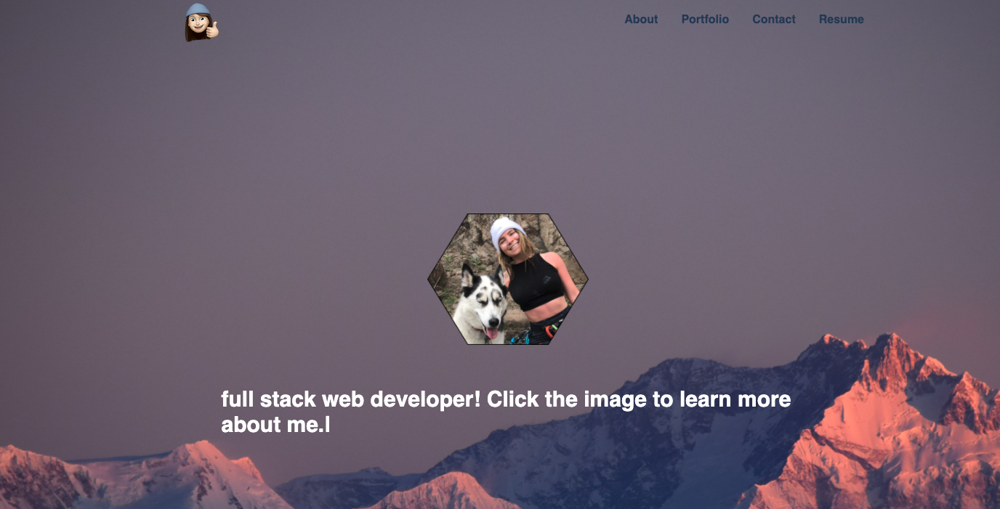

# Hi im Bridget! :wave:

  ### By bridgetvon * [Email me](bridget.schaefer31@gmail.com) * 

  ## Table of contents 📚
  * [Description](#Description)
  * [User Story](#User-story) 
  * [Installation Instructions](#installation-Instructions)
  * [Contributing](#Contributing)

  # Visual
 
 
 
  # Description
    A portfolio representing my work and showing some of my personality. The portfolio uses multiple react packages for effects and styling.  

  ## User Story :book:
  ```
  AS a developer
  I WANT to showcase my work 
  SO THAT I can get a job as a full stack web developer

  ```

  ## Installation Instructions :hammer_and_wrench:
  No installation, simply navigate to the deployed application

  ## Deployed 
   https://bridgetvon.github.io/hi-im-bridg/

  ## License :credit_card:
  * License Type: N/A


 ## Contributing 
 Bridget Schaefer 
    
 [Click to view my GitHub Profile!](https://github.com/bridgetvon) :skier:
